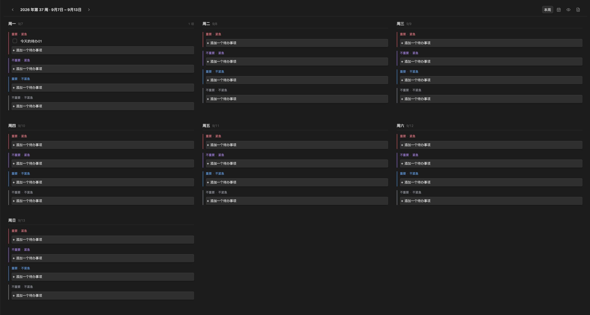
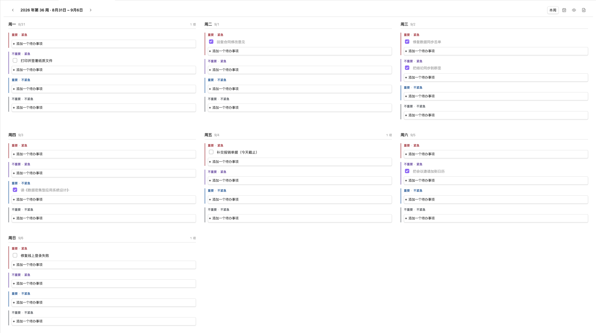
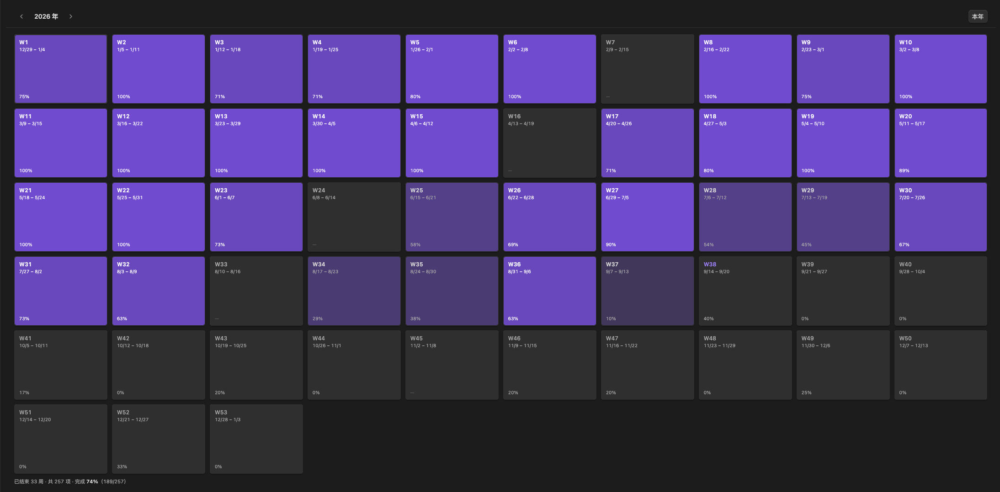
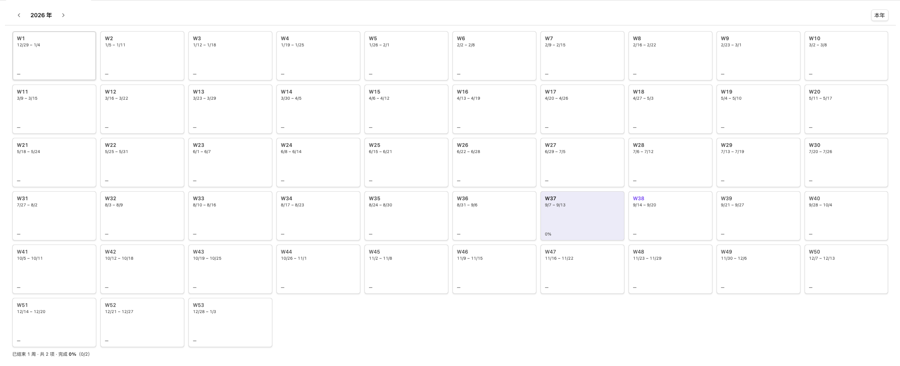

# Weekly Schedule

Plan and review your week inside Obsidian. One board per week, every day split into
four priority quadrants, and a whole year you can scan at a glance.



Each day holds four cells — important and urgent, not important but urgent,
important but not urgent, and neither. Every cell has an **Add a task**
(**添加一个待办事项** in Chinese) button that appends a task and puts the cursor in
it. Press `Enter` to commit, `Esc` to discard; a task left empty is never written
to the file.

Below the board, a status strip keeps the week's own totals in sight — **12 tasks
this week · 5 done · 42% complete** — counted from the board as you edit it, and
pinned to the bottom of the pane so a week long enough to scroll does not take its
own summary with it. A week with nothing in it says so instead.

Both views follow your Obsidian theme; the screenshots above and below are dark
and light respectively. Expand for the board in light mode and the year overview
in dark mode:

<details>
<summary>Both views in the other theme</summary>





</details>

## Jump to any week

Stepping a week at a time is fine for a week or two, and useless for reaching a
distant one. **Open year overview** shows the whole year: one tile per ISO week,
each with its week number, date range and completion rate. Select a tile to open
that week; `←` `→` `↑` `↓` move between tiles and `Enter` opens one.



Fill depth is the completion rate, in six steps. Finished weeks are filled, weeks
still to come are not, and weeks with no tasks show a dash. The year overview is a
separate pane, so it can stay open beside the board while you work.

## How tasks are stored

Standard Markdown checkboxes, one file per week, grouped in a folder per ISO year:

```
weekly-schedule/
  2025/
    2025-W52.md
  2026/
    2026-W01.md
    2026-W12.md
```

```markdown
# 2026-W12

## 周一

### 重要 · 紧急
- [ ] 交周报
- [x] 修线上 bug

### 不重要 · 不紧急
- [ ] 整理书签
```

Cells with no tasks are omitted, so the file stays short. Because it is ordinary
Markdown, these tasks are searchable, readable by other task plugins, editable by
hand, and safe to sync or version. The plugin keeps the file and the board in step:
editing the file outside the board reloads it, and an unsaved edit in the board
wins over the file rather than being discarded.

The folder is the week's **ISO** year, not its calendar year, so the week of
2025-12-29 — week 1 of 2026 — lives in `2026/`, matching how the year overview
presents it.

### Files written before year folders

Files used to sit directly in the schedule folder (`weekly-schedule/2026-W12.md`).
The plugin still reads them from there, so an existing vault does not look empty
after updating. Run the **Move week files into year folders** command (or use the
button in settings) to move them. Only files in the schedule folder named like
`YYYY-Www.md` are touched, so notes you keep there are left alone.

## Language

The plugin reads in the language Obsidian is set to (**Settings → General →
Language**), and follows a change to it straight away — no reload, and nothing to
configure.

English and Simplified Chinese are built in. Any other language falls back to the
closest one available: `zh-TW` to Simplified Chinese, everything else to English.
The sample file above shows the Chinese wording; in an English vault the same week
is written as:

```markdown
# 2026-W12

## Monday

### Important · urgent
- [ ] Send the weekly report
- [x] Fix the production bug

### Unimportant · not urgent
- [ ] Tidy the bookmarks
```

Day and priority headings are the only translated part of a file, and one rule
follows from that: **a file keeps the language it was written in.** Switching
Obsidian's language relabels the board, the year overview, the commands and the
settings tab, but it never rewrites files you already have — opening an old week
after the switch shows an English board over a Chinese file. A week with no file
yet is created in the current language, so a vault can hold both without either
failing to load: the plugin recognizes every heading in every language it ships,
and a file written before the plugin was translated keeps parsing too.

To convert an existing file, edit its headings — the language of the week's first
recognized heading decides the language the whole file is written back in.

## Privacy

The plugin runs entirely offline. It makes no network requests, collects no
telemetry, and reads and writes only its own files inside your vault.

## Installation

Once listed in the community catalog, install it from **Settings → Community
plugins → Browse**.

To install a release by hand, download `main.js`, `manifest.json` and
`styles.css` from the latest release and put them in:

```
<Vault>/.obsidian/plugins/weekly-schedule/
```

Then enable **Weekly Schedule** in **Settings → Community plugins**.

Requires Obsidian **1.5.7** or later.

## Development

Requires Node.js 18+.

```bash
npm install
npm run dev        # rebuild main.js on change
npm run build      # type check + production build
npm run lint       # ESLint with Obsidian-specific rules
npm run check:i18n # verify the localization and file-heading rules
npm run deploy -- "<Vault>"   # build output into a vault, with verification
```

`npm run deploy` copies the three release files into the vault, then compares them
byte for byte and checks that the stylesheet still carries the current design's
markers. A half-finished copy is a real failure mode: an old `styles.css` next to a
new `main.js` renders the previous design with no error anywhere.

`npm run check:i18n` bundles the localization and Markdown modules against a
stand-in for Obsidian's runtime and asserts the rules a type cannot express: a
saved file keeps its own heading language, a new one follows the interface
language, every language's headings still parse, and the dates, plurals and
notices read correctly in both languages.

Reload the plugin after any change — Obsidian reads `main.js` only when a plugin
loads.

### Layout

```
src/
  main.ts                        # Lifecycle, view registration, commands, vault events
  settings.ts                    # Settings interface, defaults, settings tab
  store.ts                       # Reading/writing week files, caching, debounced saves
  markdown.ts                    # Markdown <-> board conversion
  migrate.ts                     # Moving week files into year folders
  constants.ts                   # View types, quadrants, days, defaults
  types.ts                       # Data model
  i18n/
    index.ts                     # Language detection, t()/tp(), day and quadrant wording
    format.ts                    # Locale-aware dates and week labels
    locales/
      en.ts                      # English strings; the source of truth for the keys
      zh.ts                      # Simplified Chinese
  ui/
    weekly-schedule-view.ts      # The board
    weekly-schedule-year-view.ts # Year overview
    inline-editor.ts             # Inline plain-text editing for task rows
  utils/
    date.ts                      # Week arithmetic and file naming
    helpers.ts                   # Shared helpers, including grid fitting
scripts/
  deploy.mjs                     # The npm run deploy helper
  i18n-check/                    # The npm run check:i18n helper
  diagnose-year-view.js          # Console snippet for troubleshooting layout
```

Both views size their grid from the pane they are in rather than from the window,
because an Obsidian pane is often a sidebar or half a split.

### Adding a language

Every user-facing string goes through `t()` or `tp()`, keyed by an entry in
`src/i18n/locales/en.ts`, so the type system rejects a key that does not exist and
a translation that misses one. To add a language:

1. Copy `en.ts` to a new file and translate the values. A value may split its
   singular and plural forms with `|`; use one string for both in a language that
   does not distinguish them.
2. Add the locale to `SUPPORTED_LOCALES` and `DICTIONARIES` in `src/i18n/index.ts`,
   and map it to a BCP-47 tag in `INTL_LOCALES` in `src/i18n/format.ts`, so its
   dates read the way the language writes them.
3. Revisit the expectations in `scripts/i18n-check/checks.ts` — the fallback cases
   change as soon as a language is added — and run `npm run check:i18n`.

Day and priority headings are composed from those same strings, which is why a
translated file is written correctly without any extra work: `dayLabel()` and
`quadrantParts()` produce both the cell header and the Markdown heading.

### Releasing

```bash
# 1. Bump the version. This rewrites manifest.json and versions.json for you, and
#    npm rewrites the version in package-lock.json along with package.json.
npm version 0.1.2 --no-git-tag-version
git add manifest.json versions.json package.json package-lock.json
git commit -m "release: 0.1.2"

# 2. Tag with the exact manifest version, no leading "v".
git tag 0.1.2

# 3. Push the branch and the tag, naming the tag explicitly. Do not reach for
#    --follow-tags here: it carries annotated tags only, so it skips a
#    lightweight tag like this one without any error or warning, the branch
#    lands, and no release is ever created.
git push origin main 0.1.2
```

Pushing the tag runs `.github/workflows/release.yml`, which builds the plugin and
creates a **draft** release with `main.js`, `manifest.json` and `styles.css`
attached. Review the draft, then publish it — the tag and `manifest.json`'s
`version` must match exactly, and `versions.json` must map that version to
`minAppVersion`.

### Getting listed in the community catalog

1. Release at least one version and confirm the three release assets exist.
2. Confirm `id`, `name`, `description` and `author` in `manifest.json` are what you
   want shown publicly — the catalog entry is built from them, plus `repo`.
3. Open a pull request against
   [obsidianmd/obsidian-releases](https://github.com/obsidianmd/obsidian-releases)
   that appends one entry to `community-plugins.json`:
   ```json
   {
       "id": "weekly-schedule",
       "name": "Weekly Schedule",
       "author": "xwtaidev",
       "description": "Plan and review your week inside Obsidian.",
       "repo": "xwtaidev/obsidian-weekly-schedule-plugin"
   }
   ```
4. Keep `id` stable forever: it is the key Obsidian uses to update installed
   plugins. Changing it later breaks every existing installation.

Before submitting, check that `LICENSE` and `README.md` are present, that there are
no network calls or telemetry, and that `minAppVersion` is honest. The
`obsidianmd/no-unsupported-api` lint rule enforces that last one against
`manifest.json`, so lowering it without checking will fail `npm run lint`.

### Why the settings tab is not declarative

The declarative settings API added in Obsidian 1.13 would put these options into
Obsidian's settings search, but it would raise `minAppVersion` to 1.13 and shut out
everyone on an older release. Two dropdowns do not justify that, so the tab uses
the imperative `Setting` API and the lint rule asking for the declarative one
reports a warning that is accepted on purpose.

## API documentation

See <https://docs.obsidian.md>.
